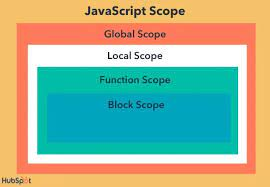
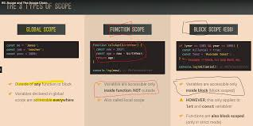
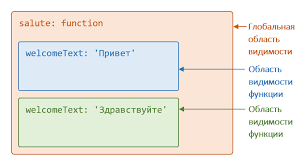
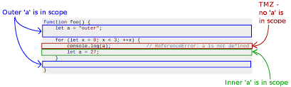

# Scope 
## Scope это область видимости в верейблах
## Есть четыре вида Scope

## 1. Global scope

## 2. Function scope

## 3. Block scope

## 4. Module scope

# .
# .
# .

# Hoisted
## Это механизм который мы пишем вперед назывется Hoisted

## Это наазывется Function declaration and Var veriables hoisted 
## Let and const and function expression hoissted это обратное значение

## let ва const это block scope .  И Var Function это scope 
## Потомучто Let и Const в блок скопе не проходят в фанкшин скопе

# .
# .
# .

## Есть 2 вида ошибки
### 1. TypeError
###  Когда  не находит Верейбл показывает это
### 2. Refference Error:
### Когда мы задаём переменую вперёд показывает это