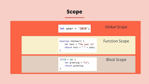

# Scope 
## Scope это область видимости в верейблах
## Область действия в JavaScript относится к текущему контексту кода, который определяет доступность переменных для JavaScript. Два основных типа области видимости в JavaScript:
## Понимание области действия и подъема помогает избежать распространенных ошибок, таких как непреднамеренная перезапись глобальных переменных, ошибки ссылок и проблемы, связанные с позиционированием объявления переменных. Это фундаментальная концепция, которая влияет на структуру и поведение вашего кода.
## Есть четыре вида Scope

## 1. Global scope
## Глобальная область: переменная находится в глобальной области, если она объявлена ​​вне всех функций или фигурных скобок ({}). К переменным в глобальной области можно получить доступ и изменить их из любой части кода после их объявления.

## 2. Function scope
## Локальная область (или область функции). Когда переменные объявляются внутри функции, они находятся в локальной области этой функции, и к ним можно получить доступ и изменить их только внутри этой функции. Однако с появлением ES6 (ECMAScript 2015) JavaScript также включает область действия на уровне блока, определяемую:

## 3. Block scope
## Область действия блока: переменные, объявленные с помощью let или const внутри блока {} (например, внутри блока if или цикла for), ограничены областью действия блока и не могут быть доступны за его пределами.

## 4. Module scope
## В JavaScript модули имеют отдельную область действия, отличную от глобальной. Это означает, что переменные, функции и другие коды, определенные внутри модуля, недоступны для кода в других модулях или в глобальной области, если они не экспортированы явно. Это помогает предотвратить конфликты имен и упрощает организацию и повторное использование кода.

## При импорте модуля импортированный код доступен только в пределах того модуля, в который он импортирован. Например, если вы импортируете модуль в функцию, импортированный код будет доступен только внутри этой функции и не будет доступен за ее пределами.

# .
# .
# .

# Hoisted
## Это механизм который мы пишем вперед назывется Hoisted
## Подъем переменных: переменные, объявленные с помощью var, поднимаются наверх своей функциональной/локальной или глобальной области независимо от того, где было сделано фактическое объявление. Однако поднимается только объявление, а не инициализация. Если вы попытаетесь использовать переменную до того, как она будет объявлена ​​и инициализирована, это приведет к неопределенному значению.

## Подъем Let и Const: переменные, объявленные с помощью let и const, также поднимаются наверх своего блока, но не инициализируются. Доступ к ним до объявления приведет к ошибке ReferenceError из-за «временной мертвой зоны» — периода между входом в область видимости и объявлением, когда к ним нельзя получить доступ.

## Это наазывется Function declaration and Var veriables hoisted 
## Let and const and function expression hoissted это обратное значение

## let и const это block scope .  И Var Function это scope 
## Потомучто Let и Const в блок скопе не проходят в фанкшин скопе

# .
# .
# .

## Есть 2 вида ошибки
# 1. TypeError
##  Когда  не находит Верейбл показывает это

# 2. Refference Error:
## Когда мы задаём переменую вперёд показывает это

#
#
#
# Var 
## Область действия: переменные, объявленные с помощью var, ограничены функцией, внутри которой они объявлены. Если они объявлены вне функции, они находятся в глобальной области видимости. var не имеет области действия на уровне блока, что означает, что если переменная объявлена ​​с var внутри блока (например, внутри оператора if или цикла), она доступна за пределами этого блока.                                           Подъем: переменные, объявленные с помощью var, поднимаются в верхнюю часть своей области видимости. Однако поднимается только объявление, а не инициализация. Если вы попытаетесь получить доступ к объявленной var переменной до того, как она будет определена, вы получите неопределенное значение, а не ReferenceError.
